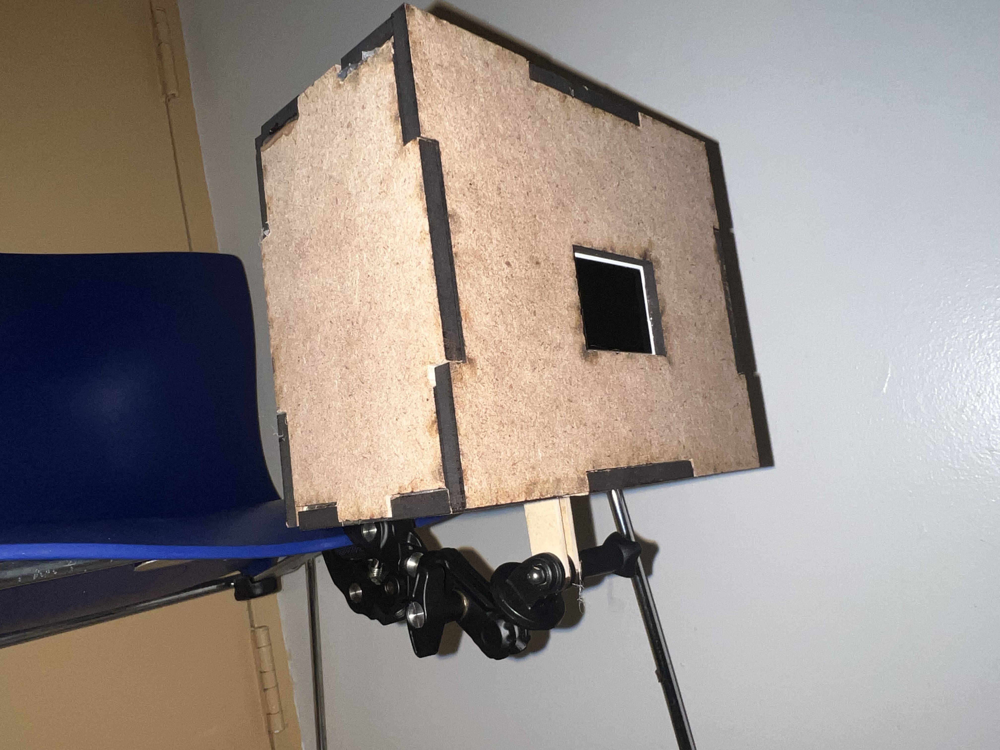
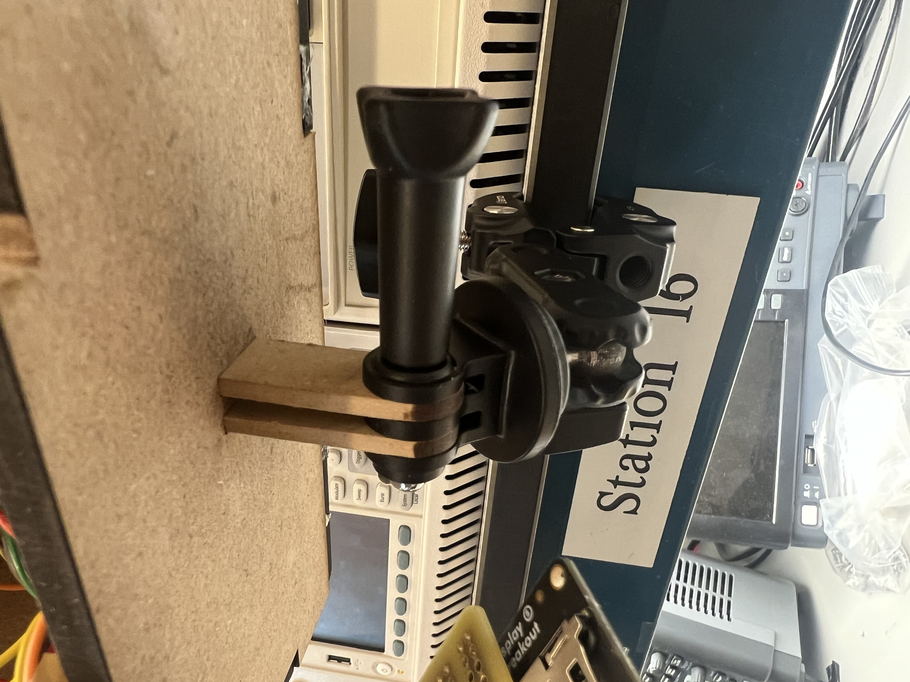
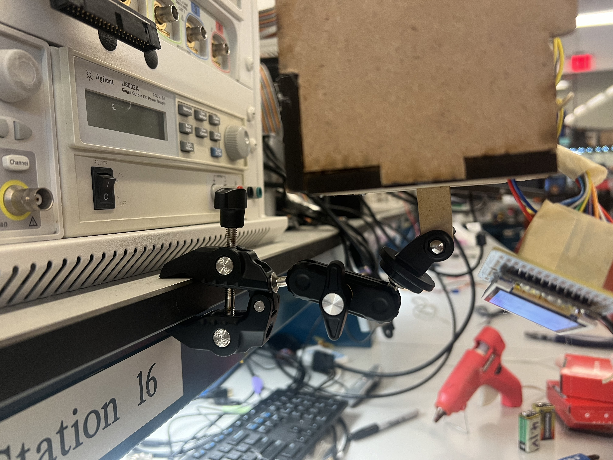
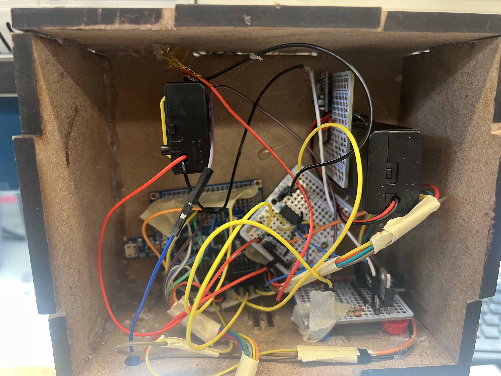
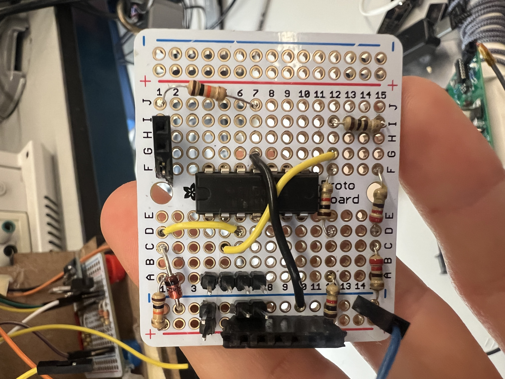
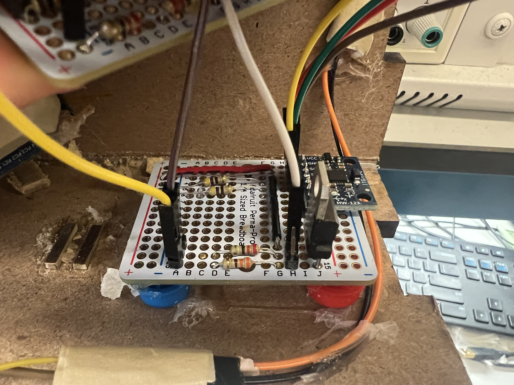
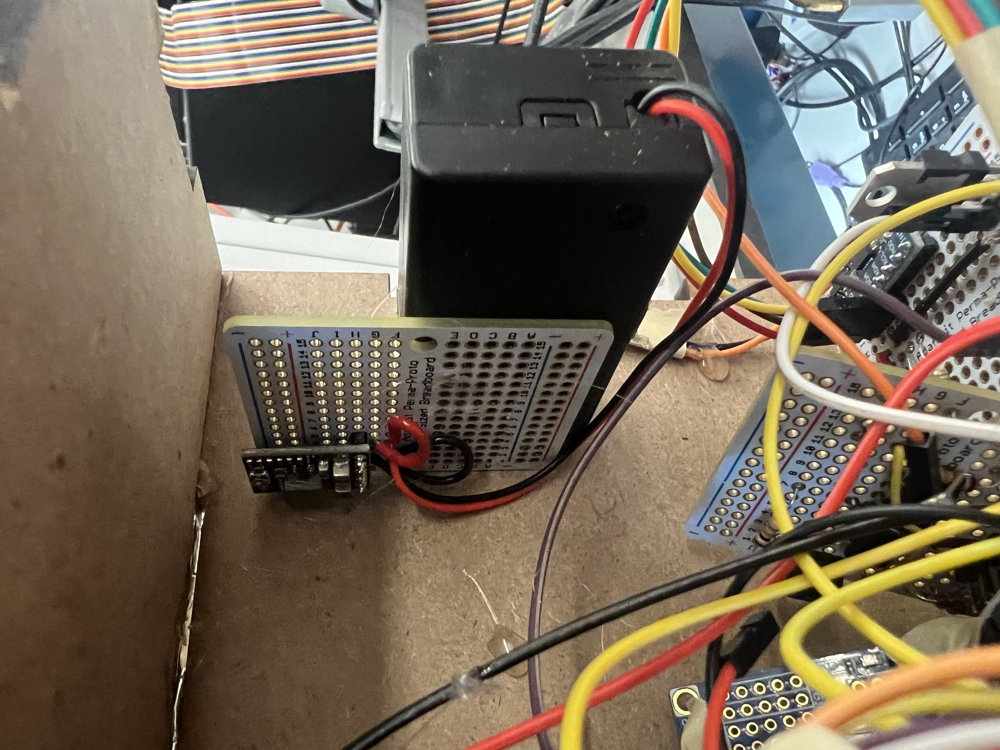

# final-project-skeleton

    * Team Name: Byte-cycle
    * Team Members: Maya Huizar and Chris Connolly
    * Github Repository URL: https://github.com/ese3500/final-project-byte-cyclle
    * Github Pages Website URL: [for final submission]
    * Description of hardware: (embedded hardware, laptop, etc) 

## Final Project Proposal

### 1. Abstract

In a few sentences, describe your final project. This abstract will be used as the description in the evaluation survey forms.

Motor vehicle accidents are the leading cause of death amongst cyclists. Our final project is a whole bike safety system equipped with dynamic lights that adjust based on time of day and accelerometer data to detect braking and activate brake lights.

### 2. Motivation

What is the problem that you are trying to solve? Why is this project interesting? What is the intended purpose?

Over 130,000 cyclists are injured every year in the United States. To mitigate the risks of sharing the road with vechiles oftentimes moving at higher speeds, we plan to make a device that increases cyclist safety by increasing visibility. Moreover, the device will be able to measure if the cyclists are slowing down or stopping and will activate brake lights to communicate these actions on the road. 

### 3. Goals

These are to help guide and direct your progress.

By the end of the project, we would like to have brake lights that dynamically adjust based on accelerater data and photosensor data to both reduce power and ensure biker safety.

We would also like a ultrasonic or other sensor system to alert the biker when a car or other large object is very close behind, for increased perception and awareness of surroundings when riding.

If time is available, we would also like to add a display for the rider to show useful information, such as battery life, speed, time riding, and the distance to the nearest car behind them.

### 4. Software Requirements Specification (SRS)

Formulate key software requirements here.

The software most importantly should take in the accelerometer data using serial communication and based on the data, decides whether or not to activate LEDs. An ADC should also be programmed for the photo resistor. Moreover, a pin change interupt should monitor the signal coming from a power management IC that detects voltage sag of the battery. Serial communication to communicate to RTC chip. Also serial communication to display all necessary information to a display. The software should also 3d render ultrasonic data to help visualize distance to cars behind.

### 5. Hardware Requirements Specification (HRS)

Formulate key hardware requirements here.

We will need a low-power usage and small form factor microcontroller to run most of our code, as well as the following sensors:

- ultrasonic sensor (waterproof / enclosed)
- photosensor (for daylight)
- real time clock chip (for current time/date + duration of trip)
- Bright LED or light for brake light
- LED/light to attract attention of user when car is near
- accelerometer (for deceleration data for breaking)
- display (for displaying accelerometer data + )
- power management/voltage supervisor circuit

### 6. MVP Demo

What do you expect to accomplish by the first milestone?

By the first milestone, we want to have the core functionality, that is, the lights turning on due to a rapid deceleration, and low power mode using the photosensor.

### 7. Final Demo

What do you expect to achieve by the final demonstration or after milestone 1?

By the final demonstration, we want to have all features that we claimed ready and working.

### 8. Methodology

What is your approach to the problem?

Our solution is a whole bike safety system equipped with dynamic lights that adjust based on time of day and accelerometer data to detect braking and activate brake lights. A photo sensor can be used to detect whether it is day or night time to adjust modes. For instance, a night mode would turn the LEDS on a dim mode when not braking to increase nighttime visibility like a car has rear tail lights that are constantly on at night. If additional time, we may add features like distance checking via ultrasonic sensors or a display for the user. The ultrasonic sensor can detect objects coming at high velocities by measuring the change of distance over time. If something is detected to be approaching quickly, a buzzer can be activated to alert the user.

### 9. Components

What major components do you need and why?

We will need a low-power usage and small form factor microcontroller to run most of our code, as well as the following sensors:

- ultrasonic sensor (waterproof / enclosed)
- photosensor (for daylight)
- real time clock chip (for current time/date + duration of trip)
- Bright LED or light for brake light
- LED/light to attract attention of user when car is near
- accelerometer (for deceleration data for breaking)
- display (for displaying accelerometer data + )
- power management/voltage supervisor circuit

### 10. Evaluation

What is your metric for evaluating how well your product/solution solves the problem? Think critically on this section. Having a boolean metric such as “it works” is not very useful. This is akin to making a speaker and if it emits sound, albeit however terrible and ear wrenching, declare this a success.
It is recommended that your project be something that you can take pride in. Oftentimes in interviews, you will be asked to talk about projects you have worked on.

The metric by which we will evaluate the success of our product/solution will be whether it meaningfully results in a change in behavior for the rider and drivers. We can test this measuring the average following distance of cars at night with the device on vs. off, and comparing the time the rider takes to notice when a car approaches them using the ultrasonic sensor, with it on and off.

### 11. Timeline

This section is to help guide your progress over the next few weeks. Feel free to adjust and edit the table below to something that would be useful to you. Really think about what you want to accomplish by the first milestone.

| **Week**            | **Task** | **Assigned To**    |
|----------           |--------- |------------------- |
| Week 1: 3/24 - 3/31 |   look for parts & basic flow charts   |     both     |
| Week 2: 4/1 - 4/7   |   begin 3d render software -- Basic software & serial communication  |     Maya -- Chris    |
| Week 3: 4/8 - 4/14  |   Continue working on software -- help software, begin hardware   |    both     |
| Week 4: 4/15 - 4/21 |   Finalize hardware -- CAD   |      Maya -- Chris        |
| Week 5: 4/22 - 4/26 |   Test & Debug    |     both    |

### 12. Proposal Presentation

Add your slides to the Final Project Proposal slide deck in the Google Drive.

## Final Project Report
# The Project

 
 

## Mounting solution

 
 

## Inside overview

 
 

## Battery Monitor Circuit + Accelerometer Board

    
    

 
 

## Buck convter / 5v voltage supply

 
 

# Video Demos

## Basic Functionality Demo

Here's a demo of the basic functionality.

https://www.dropbox.com/scl/fi/4vp9dsa5iq0sg2t89sfcs/Video-Apr-30-2024-3-07-16-PM.mov?rlkey=plww8499on7onpcxe9nlw6we7&st=25xornsa&dl=0

Here's a demo of specifically the battery monitoring system.

https://www.dropbox.com/scl/fi/pno29pdhafuwc2eaeg9j2/Video-Apr-30-2024-3-12-11-PM.mov?rlkey=vuo77kbwzmk8z318uicxoukv7&st=29hl3ac1&dl=0

# Design Requirement Specifications Revisited

## SRS

### SRS successes

SRS 01 -- detect deacceleration and turn on brake light within 500ms (average calculated about 250ms)

SRS 02 --  photoresistor LED turns off when hand is a minumum of 1cm above (average found to be about 1.25cm in detkin lighting)

SRS 03 -- display data to screen withought noticeable lag < 100 ms

## HRS
### HRS successes
HRS 01 -- use a low power microcontroller such at atmega328pb 

HRS 02 -- waterproofed photoresistor should be used to detect whether it is dark or light in the enviroment.

HRS 03 -- Have LED that is properly housed and bright enough to be scene at daytime

HRS 04 -- used I2C on MPU 6050 accelerometer to detect whether the device is deccelerating and bike is braking

HRS 05 -- used adafruit LCD screen to display accelerometer data

HRS 06 -- created a circuit to detect voltage sag of 9v battery below 8V +- 0.1V (actual measured to be about 8.08)
### HRS fails
HRS 01 -- communicate through I2C to ROTC to get time data
 

# Conclusion & Final Remarks

    When first beginning this project, we tried to inpcorporate as much as possible. Our thought was that it would be easier to cut out funcitonality rather than add features as after thoughts. We were able to include almost all features except
    the ROTC. When connecting the ROTC to the I2C bus, we were disrupting the accelerometer data. The atmega328pb could communicate to the accelerometer and would get acknowledges and send acknowledges; however, the data byte would be all zeros. I checked the pullup resistros in the circuit and datasheets. I thought that it could be because the ROTC wasn't set up, but I followed ROTC datasheet to setup after MCU initialization, and it still didn't work.

    I defintely learned to order parts way earlier than needed. I was plagued with severe package delays. Similarly, I learned to test with different components early. I think that if I tested the ROTC and accelerometer earlier, I could've gotten both to work. Testing in small parts is important, but the ROTC and accelerometer were sharing a bus, so I should've made sure they didn't break the I2C.  

    Overall, I'm really happy with the work we were able to do. We checked 5 of the requirements when only needing to have 3. I think that although we didn't get the ROTC to work, we were able to tie together almost everything we've learned this year in one project.

## References

Fill in your references here as you work on your proposal and final submission. Describe any libraries used here.

## Github Repo Submission Resources

You can remove this section if you don't need these references.

* [ESE5160 Example Repo Submission](https://github.com/ese5160/example-repository-submission)
* [Markdown Guide: Basic Syntax](https://www.markdownguide.org/basic-syntax/)
* [Adobe free video to gif converter](https://www.adobe.com/express/feature/video/convert/video-to-gif)
* [Curated list of example READMEs](https://github.com/matiassingers/awesome-readme)
* [VS Code](https://code.visualstudio.com/) is heavily recommended to develop code and handle Git commits
  * Code formatting and extension recommendation files come with this repository.
  * Ctrl+Shift+V will render the README.md (maybe not the images though)
