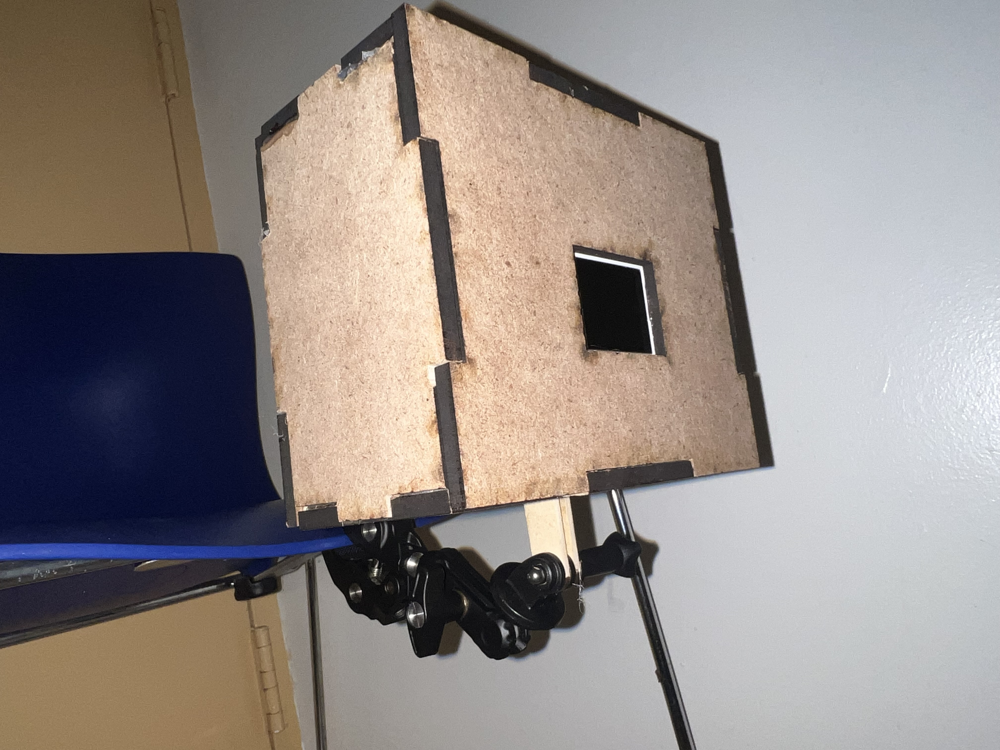
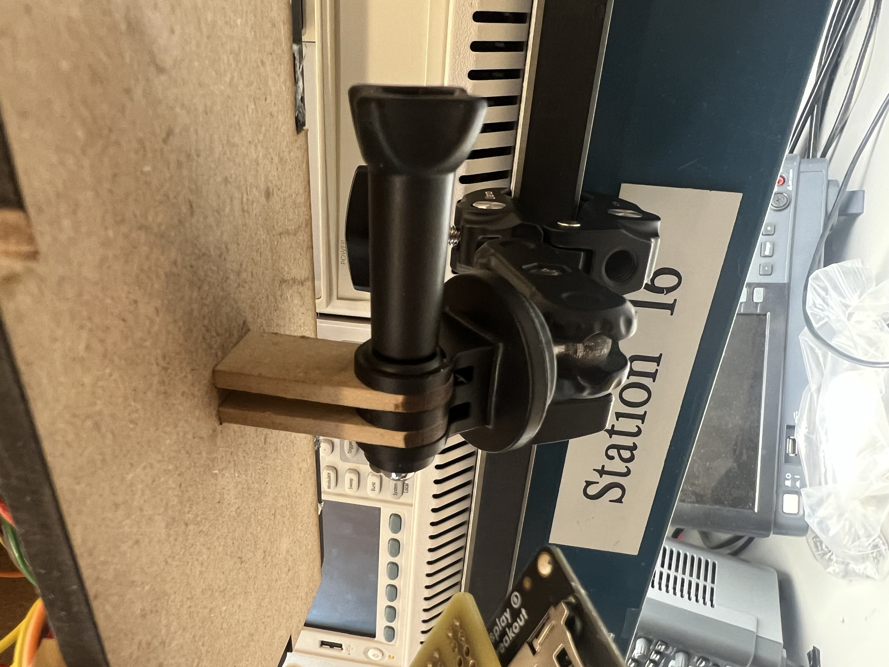
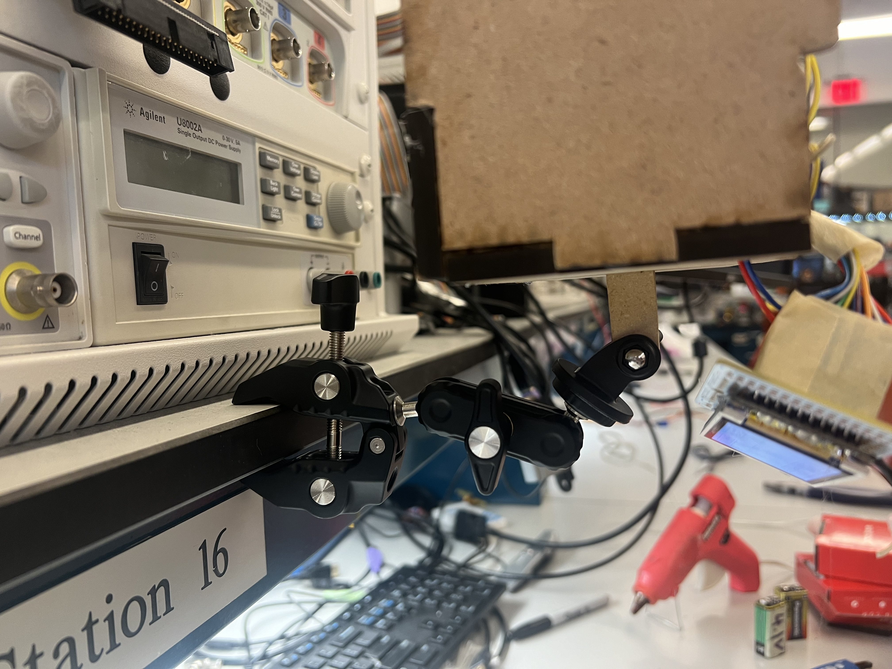
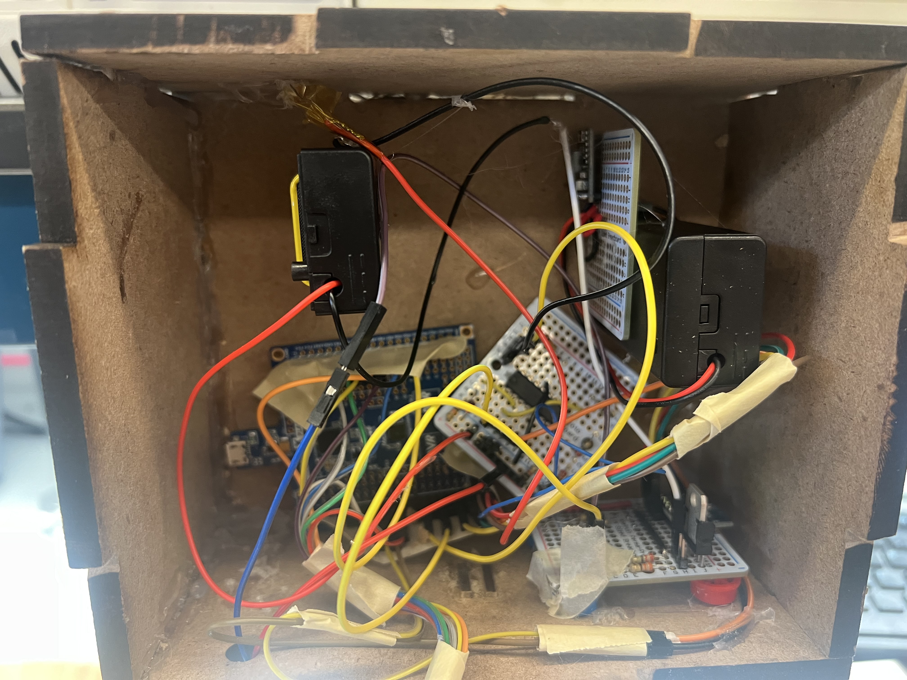
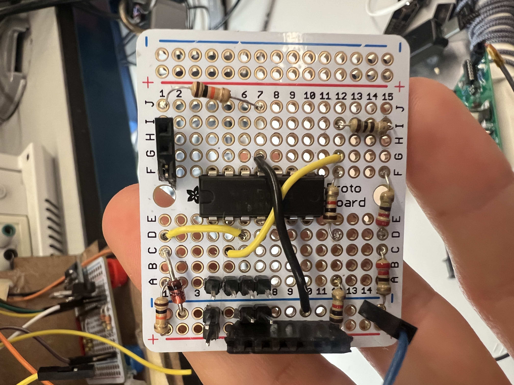
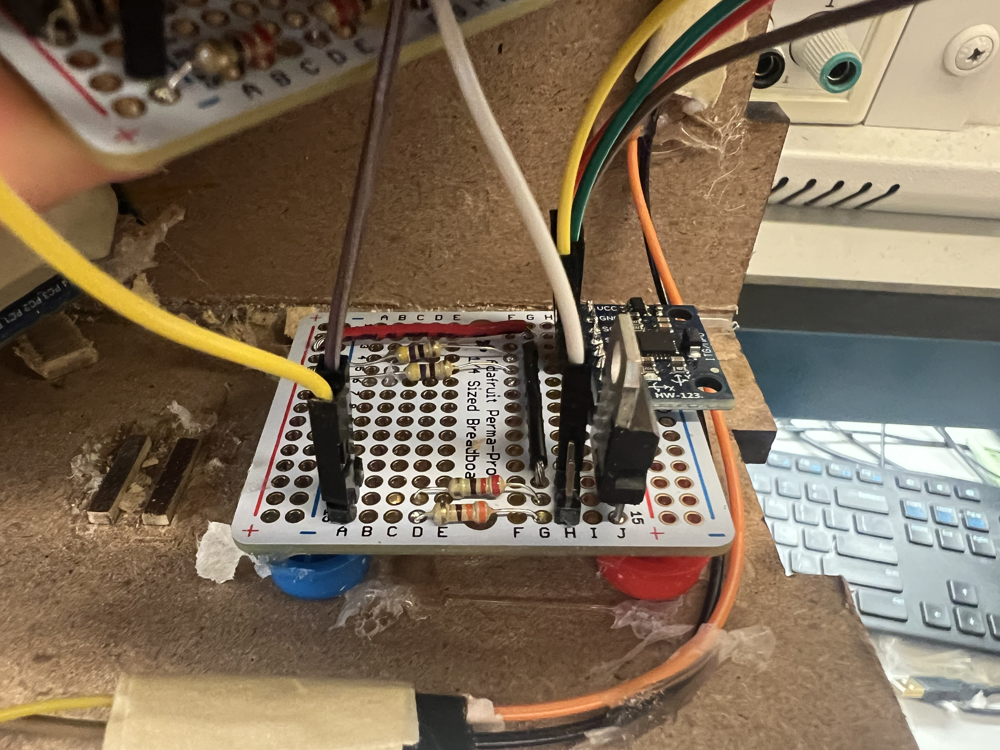

# The Project

 
 

## Mounting solution

 
 

## Inside overview

 
 

## Battery Monitor Circuit + Accelerometer Board

    
    

 
 

## Buck convter / 5v voltage supply

 
 

# Video Demos

## Basic Functionality Demo

Here's a demo of the basic functionality.

https://www.dropbox.com/scl/fi/4vp9dsa5iq0sg2t89sfcs/Video-Apr-30-2024-3-07-16-PM.mov?rlkey=plww8499on7onpcxe9nlw6we7&st=25xornsa&dl=0

Here's a demo of specifically the battery monitoring system.

https://www.dropbox.com/scl/fi/pno29pdhafuwc2eaeg9j2/Video-Apr-30-2024-3-12-11-PM.mov?rlkey=vuo77kbwzmk8z318uicxoukv7&st=29hl3ac1&dl=0

# Design Requirement Specifications Revisited

## SRS

### SRS successes

SRS 01 -- detect deacceleration and turn on brake light within 500ms (average calculated about 250ms)

SRS 02 --  photoresistor LED turns off when hand is a minumum of 1cm above (average found to be about 1.25cm in detkin lighting)

SRS 03 -- display data to screen withought noticeable lag < 100 ms

## HRS
### HRS successes
HRS 01 -- use a low power microcontroller such at atmega328pb 

HRS 02 -- waterproofed photoresistor should be used to detect whether it is dark or light in the enviroment.

HRS 03 -- Have LED that is properly housed and bright enough to be scene at daytime

HRS 04 -- used I2C on MPU 6050 accelerometer to detect whether the device is deccelerating and bike is braking

HRS 05 -- used adafruit LCD screen to display accelerometer data

HRS 06 -- created a circuit to detect voltage sag of 9v battery below 8V +- 0.1V (actual measured to be about 8.08)
### HRS fails
HRS 01 -- communicate through I2C to ROTC to get time data
 

# Conclusion & Final Remarks

    When first beginning this project, we tried to inpcorporate as much as possible. Our thought was that it would be easier to cut out funcitonality rather than add features as after thoughts. We were able to include almost all features except
    the ROTC. When connecting the ROTC to the I2C bus, we were disrupting the accelerometer data. The atmega328pb could communicate to the accelerometer and would get acknowledges and send acknowledges; however, the data byte would be all zeros. I checked the pullup resistros in the circuit and datasheets. I thought that it could be because the ROTC wasn't set up, but I followed ROTC datasheet to setup after MCU initialization, and it still didn't work.

    I defintely learned to order parts way earlier than needed. I was plagued with severe package delays. Similarly, I learned to test with different components early. I think that if I tested the ROTC and accelerometer earlier, I could've gotten both to work. Testing in small parts is important, but the ROTC and accelerometer were sharing a bus, so I should've made sure they didn't break the I2C.  

    Overall, I'm really happy with the work we were able to do. We checked 5 of the requirements when only needing to have 3. I think that although we didn't get the ROTC to work, we were able to tie together almost everything we've learned this year in one project.

